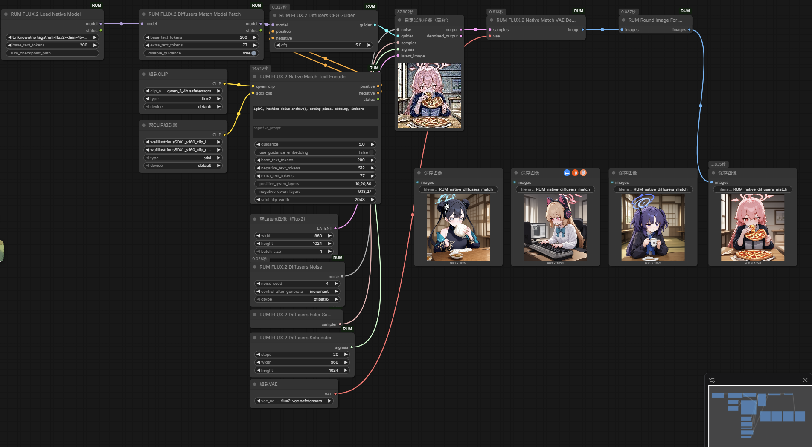

# ComfyUI-RUM

ComfyUI-RUM 是 [RimoChan/RUM](https://github.com/RimoChan/RUM) 的 ComfyUI native 节点适配。目标是把 RUM 的 FLUX.2-Klein + SDXL teacher CLIP 条件路径拆进 ComfyUI，让它既能作为普通 ComfyUI workflow 使用，也能用于像素级验证 ComfyUI 适配是否匹配原始 diffusers 推理。

RUM 的原始想法、模型和参考推理代码来自 RimoChan/RUM。本仓库只提供 ComfyUI 适配代码和 workflow，不包含模型权重。



## 当前状态

- 主分支坚持 ComfyUI native 路线，不暴露直接调用 diffusers pipeline 的节点，也不要求用户在 ComfyUI 环境安装 diffusers。
- `examples/diffusers_match_workflow_api.json` 是严格验证路径：使用 ComfyUI native 模型、CLIP、sampler 和 VAE 权重，同时复刻原始 diffusers 的关键数学细节。
- 已验证 RimoChan/RUM 仓库自带的全部 4 张 reference 图（`output_0.png` ~ `output_3.png`，4 个不同 prompt × seed 组合，20 steps，960x1024）和当前 native diffusers-match 节点链逐像素 0 差：`max_abs=0`、`mean_abs=0`、`rmse=0`。没有已知的未解决对齐问题。
- 普通 `examples/basic_workflow_api.json` 是日常出图 workflow，不承诺和原始 diffusers reference 同图。

这段状态很重要：**主分支不是 diffusers wrapper；严格对齐靠 native diffusers-match workflow。**

## 为什么需要专门的 diffusers-match 路径

RUM 不是只给 FLUX.2-Klein 加一组普通 LoRA。它把 FLUX.2 的 Qwen 文本条件和 SDXL teacher CLIP 条件拼到同一个 transformer 条件流里。要贴近原始 diffusers 推理，需要同时处理这些细节：

- Qwen 正面 prompt 使用特定 hidden states 层：`10,20,30`。
- 正面条件长度是 Qwen `200` tokens + SDXL `77` tokens。
- negative prompt 不是同样拼 SDXL，而是 Qwen `512` tokens，并使用层 `9,18,27`。
- SDXL teacher CLIP 来自 `Ine007/waiIllustriousSDXL_v160`，不能随便换成普通 `clip_l.safetensors` / `clip_g.safetensors`。
- SDXL teacher CLIP 在严格对齐 workflow 里用 `DualCLIPLoader` 加载 waiIllustriousSDXL teacher 权重。
- 初始 noise 需要复刻 diffusers CPU generator + BF16 行为。
- scheduler sigma 必须使用 Flux2KleinPipeline 的 `np.linspace(1.0, 1.0 / steps, steps)` 再做 time shift。
- RUM transformer 的 timestep 和 CFG 处理需要贴近原始推理路径。
- FLUX.2 VAE decode 需要匹配 diffusers 的 attention 公式、BF16 postprocess 和 PIL round 量化路径。

这些点少一个都会漂。漂移可能不是小数值误差，而是角色、构图、颜色和细节明显不同。

## 已解决过的关键问题

这些是适配过程中已经确认并修过的问题，保留在 README 里是为了后来的人不要重复踩坑：

1. **Qwen rotary buffer dtype 问题**
   - 问题：把 Qwen text encoder 整体 `.to(dtype=bfloat16)` 会把 `rotary_emb.inv_freq` 也转成 BF16。
   - 结果：text embedding 会偏，后面 denoise 全部跟着偏。
   - 处理：native match text encode 使用 ComfyUI Qwen 权重，但单独复刻 Qwen 关键 FP32 rotary / attention 语义，避免 buffer dtype 漂移。

2. **negative conditioning 配置问题**
   - 问题：negative 不能照正面条件拼 `200 + 77`。
   - 正确配置：`negative_text_tokens=512`，`negative_qwen_layers="9,18,27"`。
   - 处理：`RUMFlux2NativeMatchTextEncode` 和 API workflow 默认值按这个配置设置。

3. **scheduler / timestep 问题**
   - 问题：ComfyUI FLUX scheduler 和 diffusers Flux2Klein scheduler 不完全一样。
   - 处理：`RUMFlux2DiffusersScheduler` 使用 diffusers 风格 `np.linspace(1.0, 1.0 / steps)` 加 time shift；模型调用时按 diffusers 的 bfloat16 timestep 逻辑处理。

4. **noise 问题**
   - 问题：普通 ComfyUI `RandomNoise` 不等于 diffusers `randn_tensor(..., generator=torch.Generator(device="cpu"), dtype=bfloat16)`。
   - 处理：`RUMFlux2DiffusersNoise` 单独复刻 diffusers CPU BF16 noise 生成。

5. **VAE decode 问题**
   - 问题：ComfyUI 默认 VAE attention / 后处理路径会让最终 PNG 产生像素级差异；普通 `VAEDecode + SaveImage` 不是原始 PIL round 路径。
   - 处理：`RUMFlux2NativeMatchVAEDecode` 只用 ComfyUI 已加载的 `flux2-vae.safetensors` 权重，但在 VAE attention、BF16 postprocess 和保存前 round 量化上对齐 diffusers 行为；workflow 再接 `RUMRoundImageForSave` 后交给 `SaveImage`。

6. **VAE attention dtype mismatch**
   - 问题：ComfyUI 的 `GroupNorm` 会把 BF16 tensor 自动 upcast 到 FP32。后续 `F.linear` 接收 FP32 hidden_states 和 BF16 weight，触发 `expected scalar type BFloat16 but found Float` 或产生不正确的像素值。
   - 影响：全部像素偏移，mean_abs ≈ 2–3，PSNR ≈ 28 dB。看上去是"同一张图但有微小差异"。
   - 处理：`_vae_linear` helper 在做 `F.linear` 前把 weight/bias cast 到和 hidden_states 相同的 dtype。修正后 4 组 reference 图全部 pixel-identical。

7. **`--cpu-vae` 导致像素偏移**
   - 问题：部分 ComfyUI 发行版（如秋叶启动器）默认带 `--cpu-vae` 参数，让 VAE decode 在 CPU 上执行。CPU 和 GPU 的浮点运算结果存在微小差异（不同的 SDPA backend、不同的舍入行为）。
   - 影响：全部像素偏移 0–7，mean_abs ≈ 0.3。图片内容完全一致但不是逐像素相同。
   - 处理：做严格像素对齐验证时，不要使用 `--cpu-vae`。RTX 3090 等 24 GB 显卡完全可以同时在 GPU 上跑 model + VAE。

## Workflow 说明

仓库只保留两个示例 workflow，避免误用。

### 普通 native workflow

```text
examples/basic_workflow_api.json
```

用途：日常 ComfyUI 使用。它走 ComfyUI 常规模型、CLIP、scheduler、VAE 节点，比较容易接入其他 ComfyUI 工作流。

限制：不保证和 RimoChan/RUM diffusers reference 同图。

### diffusers-match API workflow

```text
examples/diffusers_match_workflow_api.json
```

用途：验证 ComfyUI 适配是否贴近原始 diffusers 推理。它仍然是 native workflow，不需要安装 diffusers，也不需要原始 `FLUX.2-klein-base-4B` diffusers 目录。

默认参数：

```text
prompt=1girl, kisaki (blue archive), eating baozi, sitting, indoors
negative_prompt=
seed=1
steps=20
guidance_scale=5
width=960
height=1024
```

重要：不同 ComfyUI 发行版的模型下拉名可能不同。例如 Aki 里可能显示成 `Unknown\no tags\rum-flux2-klein-4b-preview.safetensors`。公开 workflow 不能写死每个人本地的模型分类路径；如果 API validation 失败，请把 `rum_checkpoint_name` 改成你本机 `/object_info/RUMFlux2LoadNativeModel` 里实际列出的名字。

## 模型文件

diffusers-match workflow 需要的模型：

| 用途 | 推荐文件 | ComfyUI 位置 |
| --- | --- | --- |
| RUM checkpoint | `rum-flux2-klein-4b-preview.safetensors` | `models/diffusion_models/` |
| Qwen text encoder | `qwen_3_4b.safetensors` | `models/text_encoders/` |
| FLUX.2 VAE | `flux2-vae.safetensors` | `models/vae/` |
| SDXL teacher CLIP-L | `waiIllustriousSDXL_v160_clip_l.safetensors` | `models/text_encoders/` |
| SDXL teacher CLIP-G | `waiIllustriousSDXL_v160_clip_g.safetensors` | `models/text_encoders/` |

普通 native workflow 还需要 FLUX.2-Klein base 底模（如 `flux-2-klein-4b-fp8.safetensors`，放在 `models/diffusion_models/`）和通用 SDXL CLIP 权重（`clip_l.safetensors` / `clip_g.safetensors`）。

`diffusers-match` 不需要额外的 diffusers 模型目录；严格对齐所需的模型都通过 ComfyUI native 模型文件加载。若你已经有 `waiIllustriousSDXL_v160_text` diffusers text-only 目录，可以用脚本把 teacher CLIP 权重转换/安装到 ComfyUI：

```bash
python scripts/install_diffusers_teacher_clip.py /path/to/waiIllustriousSDXL_v160_text
```

也可以使用下载辅助脚本：

```bash
python scripts/download_models.py --all
```

## 安装和检查

把仓库放到 ComfyUI 的 custom nodes：

```text
ComfyUI/custom_nodes/ComfyUI-RUM
```

安装依赖后重启 ComfyUI：

```bash
pip install -r requirements.txt
```

检查节点和模型可见性：

```bash
python scripts/check_install.py --comfy-root /path/to/ComfyUI
```

提交 API workflow：

```bash
python scripts/queue_workflow.py examples/diffusers_match_workflow_api.json --server http://127.0.0.1:8188
```

## 数值验证建议

不要只靠看图判断适配是否正确。建议至少比较：

- text embedding：positive Qwen、positive combined、negative Qwen。
- initial noise：CPU generator、dtype、shape。
- scheduler sigmas 和每步 timestep。
- transformer 每步 raw noise / CFG noise / latent after step。
- final latent。
- VAE decode 后 RGB tensor。
- 最终 PNG 像素指标：`pixel_equal`、`max_abs`、`mean_abs`、`rmse`。

如果 PNG 不一致，先找第一处 tensor 非零差异。不要先调 prompt，也不要靠肉眼猜。

## 常见问题

### API workflow 报模型名不在列表

ComfyUI 的模型下拉名来自本机文件扫描，不同发行版会带不同子目录分类。解决方法：

1. 打开 `http://127.0.0.1:8188/object_info/RUMFlux2LoadNativeModel`。
2. 找到 `rum_checkpoint_name` 列表里你本机真实的 RUM checkpoint 名字。
3. 把 workflow 里的 `rum_checkpoint_name` 改成那个完整名字。

### 普通 workflow 和 diffusers-match workflow 该用哪个

- 要日常出图：用 `basic_workflow_api.json`。
- 要验证适配正确性：用 `diffusers_match_workflow_api.json`。
- 要和 RimoChan/RUM 的某张 reference 图对齐：必须先确认 reference 的 prompt、seed、模型文件、teacher CLIP、diffusers 版本和保存路径。

### 为什么同样 prompt/seed 还是不同

常见原因：

- 用了普通 native workflow，而不是 diffusers-match workflow。
- teacher CLIP 文件不一致（必须使用 waiIllustriousSDXL teacher 权重）。
- Qwen 层号或 token 长度不一致。
- negative prompt 路径不一致。
- noise dtype 或 generator device 不一致。
- scheduler 和 timestep rounding 不一致。
- VAE decode 没有使用 `RUMFlux2NativeMatchVAEDecode`，或保存前没有接 `RUMRoundImageForSave`。
- 模型文件不是同一个权重，或者同源但精度不同。
- ComfyUI 启动时带了 `--cpu-vae`，导致 VAE decode 在 CPU 上执行，浮点结果和 GPU 不同。

## Credit

- [RimoChan/RUM](https://github.com/RimoChan/RUM)：RUM 的原始项目、模型、训练和 diffusers 推理参考。
- [ComfyUI](https://github.com/comfyanonymous/ComfyUI)：ComfyUI 节点系统和执行环境。
- [Hugging Face diffusers](https://github.com/huggingface/diffusers)：FLUX.2-Klein pipeline、scheduler、VAE decode 参考实现。

## License note

本仓库不包含模型权重。RUM 上游项目在本适配开始时没有明确 LICENSE；模型和代码的再分发请遵守各自上游规则。

---

# ComfyUI-RUM English README

ComfyUI-RUM is a native ComfyUI node adapter for [RimoChan/RUM](https://github.com/RimoChan/RUM). It brings the RUM FLUX.2-Klein + SDXL teacher CLIP conditioning path into ComfyUI for both normal workflows and pixel-level validation against the original diffusers inference behavior.

The original RUM idea, model, training work, and reference inference code come from RimoChan/RUM. This repository only provides ComfyUI adapter code and example workflows. It does not include model weights.

## Current Status

- The main branch stays native-only: it does not expose a node that directly calls a diffusers pipeline, and users do not need to install diffusers into ComfyUI.
- `examples/diffusers_match_workflow_api.json` is the strict validation path. It uses native ComfyUI model, CLIP, sampler, and VAE weights while reproducing the important diffusers math details.
- All 4 upstream RimoChan/RUM reference images (`output_0.png` through `output_3.png`, 4 different prompt/seed combinations, 20 steps, 960x1024) have been verified pixel-identical with the current native diffusers-match node chain: `max_abs=0`, `mean_abs=0`, `rmse=0`. There are no known unsolved alignment issues.
- `examples/basic_workflow_api.json` is for everyday generation and does not promise image identity with original diffusers references.

Important: **main is not a diffusers wrapper; exact validation is achieved through the native diffusers-match workflow.**

## Why diffusers-match Exists

RUM is not a simple LoRA on top of FLUX.2-Klein. It combines FLUX.2 Qwen text conditioning with SDXL teacher CLIP conditioning in the transformer condition stream. Matching the original diffusers inference requires several details to line up:

- Positive Qwen prompt uses hidden-state layers `10,20,30`.
- Positive conditioning uses Qwen `200` tokens plus SDXL `77` tokens.
- Negative conditioning uses Qwen `512` tokens and layers `9,18,27`; it does not append the SDXL branch in the same way as the positive path.
- SDXL teacher CLIP comes from `Ine007/waiIllustriousSDXL_v160`; generic `clip_l.safetensors` and `clip_g.safetensors` are not equivalent.
- The strict workflow loads SDXL teacher CLIP via `DualCLIPLoader` with the waiIllustriousSDXL teacher weights.
- Initial noise must match diffusers CPU generator + BF16 behavior.
- Scheduler sigmas must use Flux2KleinPipeline-style `np.linspace(1.0, 1.0 / steps, steps)` before time shift.
- Timestep and CFG behavior must follow the original inference path.
- FLUX.2 VAE decode must match diffusers attention formula, BF16 postprocess, and PIL round quantization.

If one of these details is wrong, the result can drift across sampling steps. The drift can affect character identity, composition, colors, and fine details.

## Bugs Already Found and Fixed

These notes are kept here so future debugging does not repeat the same mistakes.

1. **Qwen rotary buffer dtype**
   - Problem: converting the Qwen text encoder with `.to(dtype=bfloat16)` also converts `rotary_emb.inv_freq` to BF16.
   - Effect: text embeddings drift, then the whole denoise path drifts.
   - Fix: native match text encoding uses ComfyUI Qwen weights but reproduces the key Qwen FP32 rotary / attention semantics to avoid buffer dtype drift.

2. **Negative conditioning configuration**
   - Problem: negative conditioning should not mirror the positive `200 + 77` token layout.
   - Correct settings: `negative_text_tokens=512`, `negative_qwen_layers="9,18,27"`.
   - Fix: `RUMFlux2NativeMatchTextEncode` and the API workflow use these defaults.

3. **Scheduler and timestep behavior**
   - Problem: ComfyUI's normal FLUX scheduler is not identical to the diffusers Flux2Klein scheduler.
   - Fix: `RUMFlux2DiffusersScheduler` uses diffusers-style `np.linspace(1.0, 1.0 / steps)` plus time shift, and the model call follows diffusers bfloat16 timestep behavior.

4. **Initial noise**
   - Problem: ComfyUI `RandomNoise` is not identical to diffusers `randn_tensor(..., generator=torch.Generator(device="cpu"), dtype=bfloat16)`.
   - Fix: `RUMFlux2DiffusersNoise` reproduces the diffusers CPU BF16 noise path.

5. **VAE decode path**
   - Problem: ComfyUI's default VAE attention / postprocess path can create pixel-level PNG differences; plain `VAEDecode + SaveImage` is not the original PIL round path.
   - Fix: `RUMFlux2NativeMatchVAEDecode` uses only the loaded ComfyUI `flux2-vae.safetensors` weights, but aligns VAE attention, BF16 postprocess, and pre-save round quantization with diffusers behavior. The workflow then passes the image through `RUMRoundImageForSave` before `SaveImage`.

6. **VAE attention dtype mismatch**
   - Problem: ComfyUI's `GroupNorm` automatically upcasts BF16 tensors to FP32. The subsequent `F.linear` call then receives FP32 hidden_states with BF16 weights, causing either a `expected scalar type BFloat16 but found Float` error or silently producing incorrect pixel values.
   - Effect: every pixel shifts by a small amount (mean_abs ~2–3, PSNR ~28 dB). The image looks like "the same picture with slight differences".
   - Fix: `_vae_linear` helper casts weight and bias to match the hidden_states dtype before calling `F.linear`. After this fix, all 4 reference images are pixel-identical.

7. **`--cpu-vae` causes pixel drift**
   - Problem: some ComfyUI distributions (e.g. the Aki launcher) start with `--cpu-vae` by default, running VAE decode on CPU. CPU and GPU floating-point results differ slightly due to different SDPA backends and rounding behavior.
   - Effect: every pixel shifts by 0–7, mean_abs ~0.3. The image content is identical but not pixel-equal.
   - Fix: do not use `--cpu-vae` when running strict pixel-alignment validation. GPUs with 24 GB VRAM (e.g. RTX 3090) can run model + VAE on GPU simultaneously.

## Workflows

Only two public example workflows are kept to reduce confusion.

### Normal Native Workflow

```text
examples/basic_workflow_api.json
```

Use this for regular ComfyUI generation. It uses normal ComfyUI model loading, CLIP, scheduler, and VAE nodes.

Limitation: it does not guarantee image identity with RimoChan/RUM diffusers references.

### diffusers-match API Workflow

```text
examples/diffusers_match_workflow_api.json
```

Use this for validation against the original diffusers inference behavior. It is still a native workflow: it does not require installing diffusers or providing the original `FLUX.2-klein-base-4B` diffusers directory.

Default parameters:

```text
prompt=1girl, kisaki (blue archive), eating baozi, sitting, indoors
negative_prompt=
seed=1
steps=20
guidance_scale=5
width=960
height=1024
```

Different ComfyUI distributions may expose different model names in the dropdown. For example, Aki may list the model as `Unknown\no tags\rum-flux2-klein-4b-preview.safetensors`. The public workflow cannot hard-code every local folder category. If API validation fails, read `/object_info/RUMFlux2LoadNativeModel` and set `rum_checkpoint_name` to the exact local name shown there.

## Model Files

Models required by the diffusers-match workflow:

| Purpose | Recommended file | ComfyUI location |
| --- | --- | --- |
| RUM checkpoint | `rum-flux2-klein-4b-preview.safetensors` | `models/diffusion_models/` |
| Qwen text encoder | `qwen_3_4b.safetensors` | `models/text_encoders/` |
| FLUX.2 VAE | `flux2-vae.safetensors` | `models/vae/` |
| SDXL teacher CLIP-L | `waiIllustriousSDXL_v160_clip_l.safetensors` | `models/text_encoders/` |
| SDXL teacher CLIP-G | `waiIllustriousSDXL_v160_clip_g.safetensors` | `models/text_encoders/` |

The normal native workflow additionally needs a FLUX.2-Klein base model (e.g. `flux-2-klein-4b-fp8.safetensors` in `models/diffusion_models/`) and generic SDXL CLIP weights (`clip_l.safetensors` / `clip_g.safetensors`).

The `diffusers-match` path does not need an extra diffusers model directory; all strict-match model inputs are loaded as native ComfyUI model files. If you already have a `waiIllustriousSDXL_v160_text` diffusers text-only directory, you can install the teacher CLIP weights into ComfyUI with:

```bash
python scripts/install_diffusers_teacher_clip.py /path/to/waiIllustriousSDXL_v160_text
```

You can also use the helper downloader:

```bash
python scripts/download_models.py --all
```

## Install and Check

Put this repository under:

```text
ComfyUI/custom_nodes/ComfyUI-RUM
```

Install dependencies and restart ComfyUI:

```bash
pip install -r requirements.txt
```

Check node import and model visibility:

```bash
python scripts/check_install.py --comfy-root /path/to/ComfyUI
```

Queue an API workflow:

```bash
python scripts/queue_workflow.py examples/diffusers_match_workflow_api.json --server http://127.0.0.1:8188
```

## Numeric Validation

Do not rely on visual inspection only. For alignment work, compare at least:

- text embeddings: positive Qwen, combined positive, negative Qwen.
- initial noise: CPU generator, dtype, shape.
- scheduler sigmas and per-step timestep.
- transformer raw noise, CFG noise, and latent after each step.
- final latent.
- RGB tensor after VAE decode.
- final PNG metrics: `pixel_equal`, `max_abs`, `mean_abs`, `rmse`.

When PNGs differ, find the first tensor stage with a non-zero difference before changing prompts or judging by eye.

## FAQ

### API workflow says the model name is not in the list

ComfyUI model names come from local file scanning. Different packages may add different subfolder categories. Fix:

1. Open `http://127.0.0.1:8188/object_info/RUMFlux2LoadNativeModel`.
2. Find the exact local RUM checkpoint name in `rum_checkpoint_name`.
3. Put that full name into the workflow.

### Which workflow should I use?

- For normal image generation: `basic_workflow_api.json`.
- For adapter validation: `diffusers_match_workflow_api.json`.
- For matching a specific RimoChan/RUM reference image: first confirm the exact prompt, seed, model files, teacher CLIP, diffusers version, and save path.

### Why can the same prompt and seed still differ?

Common causes:

- The normal native workflow was used instead of the diffusers-match workflow.
- Teacher CLIP files differ (must use the waiIllustriousSDXL teacher weights).
- Qwen layers or token lengths differ.
- Negative prompt path differs.
- Noise dtype or generator device differs.
- Scheduler or timestep rounding differs.
- VAE decode is not using `RUMFlux2NativeMatchVAEDecode`, or the image is not passed through `RUMRoundImageForSave` before saving.
- Model weights are not identical, or are from the same source but different precision.
- ComfyUI was started with `--cpu-vae`, causing VAE decode to run on CPU where floating-point results differ from GPU.

## Credit

- [RimoChan/RUM](https://github.com/RimoChan/RUM): original RUM project, model, training, and diffusers inference reference.
- [ComfyUI](https://github.com/comfyanonymous/ComfyUI): node system and execution environment.
- [Hugging Face diffusers](https://github.com/huggingface/diffusers): FLUX.2-Klein pipeline, scheduler, and VAE decode reference implementation.

## License Note

This repository does not include model weights. At the time this adapter work started, upstream RUM did not provide a clear LICENSE. Follow upstream rules for model and code redistribution.
